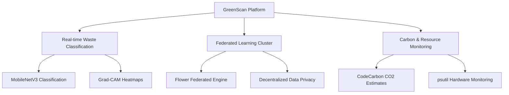

# GreenScan: Eco-Friendly Waste Intelligence Platform

GreenScan is a lightweight, sustainability-first waste intelligence and classification platform. It blends real-time computer vision classification with **Federated Learning (FL)** while actively measuring and reporting the carbon footprint and computational resources consumed during training and inference workloads. 

---

## 💡 Core Concepts & Vision

Modern deep learning workloads are notoriously carbon-intensive. GreenScan introduces **"Green AI" principles** into waste classification by demonstrating how intelligent sorting can be built and optimized without ignoring its environmental cost.

The platform centers on three primary pillars:

### 1. Real-Time Waste Classification & Interpretability
* **Lightweight Computer Vision**: Rather than using heavy, power-hungry neural networks, GreenScan utilizes **MobileNetV3-Small** to run fast, low-latency classifications on resource-constrained edge devices.
* **Explainable AI (XAI)**: Using **Grad-CAM (Gradient-weighted Class Activation Mapping)**, the application generates real-time heatmaps that overlay onto uploaded images. This reveals exactly which pixels/features (e.g., bottle caps, paper textures) the model focused on to make its decision, building user trust and helping developers debug classification paths.
* **Fallback Logic**: If no custom-trained weights exist yet, the model falls back to a pretrained ImageNet model combined with a class-voting keyword mapper.

### 2. Privacy-Preserving Federated Learning (FL)
* **Collaborative & Decentralized**: Traditionally, models are trained by gathering all user images onto a single server, raising serious data privacy concerns. Under FL, training is distributed.
* **Local Processing, Global Update**: Multiple clients (edge nodes) train local models on local datasets. Instead of sending raw pictures to the server, they only transmit model parameters (weights).
* **Flower Aggregation Strategy**: The server coordinates rounds of training and aggregates client weights using a custom `GreenFedAvg` strategy (a subclass of Flower's `FedAvg`), which monitors network bandwidth and accumulated emissions at each step.

### 3. Comprehensive Carbon & Resource Tracking
* **Carbon Tracing**: GreenScan embeds carbon tracking natively inside both centralized and federated workloads. It estimates greenhouse gas emissions (in kg of CO₂) based on the underlying grid's regional emission factors.
* **Hardware Telemetry**: While training runs, low-level sensors log CPU utilization, RAM footprint, duration, and network bandwidth, correlating performance efficiency directly to environmental impact.
* **Structured Auditing & Reporting**: Historical run data is saved in a local relational database, and users can generate downloadable PDF, CSV, and Excel training summaries.

---

## 🛠️ The Technology Stack: What is Being Used?

GreenScan's architecture is divided into the Python AI/Server ecosystem and the client-facing Web Dashboard:

### 1. Core Deep Learning & Vision
* **`torch` (PyTorch)**: The backbone deep learning library used to load, modify, and run training loops for convolutional neural networks.
* **`torchvision`**: Provides pretrained models (like MobileNetV3-Small), standard image transforms (resizing, crop, tensor conversion, normalization), and dataset loaders.
* **`Pillow` (PIL)**: Used to decode and process uploaded images before conversion to tensors.
* **Grad-CAM Implementation**: Handcrafted hooks to extract gradients and activation maps from the final convolutional layer of MobileNetV3.

### 2. Federated Learning Infrastructure
* **`flwr` (Flower Framework)**: The orchestrator powering the federated cluster. It handles gRPC communication, client synchronization, training rounds, and weight aggregation between the server (`fl_server.py`) and clients (`fl_client.py`).

### 3. Telemetry & Sustainability Logging
* **`codecarbon`**: A specialized Python package that estimates the carbon dioxide ($CO_2$) emissions of computational processes. It tracks power consumption of hardware (CPU/GPU/RAM) and calculates emissions based on the local energy grid.
* **`psutil`**: A cross-platform library for retrieving information on running processes and system utilization. It tracks CPU usage, RAM consumption, and network bandwidth (bytes sent/received) during active training loops.

### 4. Backend Orchestration & Database
* **`FastAPI`**: A modern, asynchronous, high-performance web framework for Python. It exposes REST API endpoints for prediction, training, state monitoring, and static UI file serving.
* **`Uvicorn`**: The ASGI server implementation running the FastAPI app.
* **`WebSockets`**: Bidirectional sockets used to stream real-time training telemetry (loss, accuracy, epoch steps, emissions) directly to the web dashboard.
* **`SQLAlchemy`**: Python SQL toolkit and Object Relational Mapper (ORM) used to map database tables to clean Python classes.
* **`SQLite` (`greenscan.db`)**: A lightweight, serverless relational database engine storing training runs, epoch-by-epoch statistics, FL rounds, prediction history, and model registry details.

### 5. Document & Report Generation
* **`reportlab`**: Used to programmatically build publication-quality PDF documents containing dataset metrics, training charts, and tabular summaries.
* **`openpyxl`**: Used to generate multi-sheet Excel workbooks (`.xlsx`) separating centralized training history, federated round-robin details, and registry comparisons.
* **`csv`**: Python's native module to export clean CSVs of raw metrics.

### 6. Frontend Dashboard
* **Vanilla HTML5 & CSS3**: Designed with a sleek, premium dark-theme layout using CSS variables, custom grid systems, and glassmorphism styling elements.
* **Vanilla JavaScript (ES6+)**: Handles drag-and-drop file uploads, coordinates AJAX/Fetch requests, establishes WebSocket channels for training updates, and manages UI states dynamically.
* **`Chart.js`**: Standard interactive graphing library used to plot real-time loss, accuracy, and carbon trajectories.

---

## 📁 File-by-File Blueprint

| Component / File | Primary Purpose | Tech Used |
| :--- | :--- | :--- |
| **[api_backend.py](file:///c:/Users/Mahmoud/Downloads/ode/api_backend.py)** | Central orchestration server & Web UI host | FastAPI, Uvicorn, WebSockets |
| **[index.html](file:///c:/Users/Mahmoud/Downloads/ode/index.html)** | Single-page responsive web dashboard | HTML5, CSS3, JS, Chart.js |
| **[green_tracker.py](file:///c:/Users/Mahmoud/Downloads/ode/green_tracker.py)** | Hardware resource & CO₂ carbon tracking utility | CodeCarbon, psutil |
| **[waste_model.py](file:///c:/Users/Mahmoud/Downloads/ode/waste_model.py)** | Inference engine, classification logic, fallback keyword map | PyTorch, torchvision, PIL |
| **[gradcam.py](file:///c:/Users/Mahmoud/Downloads/ode/gradcam.py)** | Generates prediction heatmaps for spatial visualization | PyTorch, NumPy, OpenCV |
| **[fl_server.py](file:///c:/Users/Mahmoud/Downloads/ode/fl_server.py)** | Federated Learning server with custom aggregation logging | Flower (`flwr`) |
| **[fl_client.py](file:///c:/Users/Mahmoud/Downloads/ode/fl_client.py)** | Federated client edge node performing local training loops | Flower (`flwr`), PyTorch |
| **[training_engine.py](file:///c:/Users/Mahmoud/Downloads/ode/training_engine.py)** | Local/centralized training engine with hardware logging | PyTorch, GreenMetricsTracker |
| **[database.py](file:///c:/Users/Mahmoud/Downloads/ode/database.py)** | Data modeling, persistence layer, and SQL utilities | SQLite, SQLAlchemy ORM |
| **[dataset_manager.py](file:///c:/Users/Mahmoud/Downloads/ode/dataset_manager.py)** | Synthetic data generator, train/val loaders, thumbnails | PyTorch DataLoaders, PIL |
| **[report_generator.py](file:///c:/Users/Mahmoud/Downloads/ode/report_generator.py)** | File compiler exporting PDF, Excel, and CSV reports | reportlab, openpyxl, csv |
