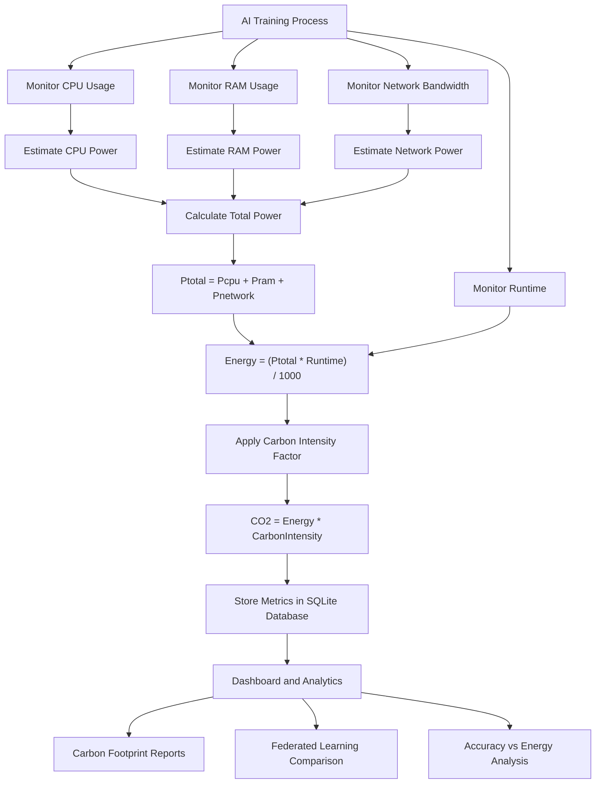

```mermaid
flowchart TD

    A[AI Training Process]

    A --> B[Monitor CPU Usage]
    A --> C[Monitor RAM Usage]
    A --> D[Monitor Network Bandwidth]
    A --> E[Monitor Runtime]

    B --> F[Estimate CPU Power]
    C --> G[Estimate RAM Power]
    D --> H[Estimate Network Power]

    F --> I[Calculate Total Power]
    G --> I
    H --> I

    I --> J["Ptotal = Pcpu + Pram + Pnetwork"]

    J --> K["Energy = (Ptotal * Runtime) / 1000"]

    E --> K

    K --> L[Apply Carbon Intensity Factor]

    L --> M["CO2 = Energy * CarbonIntensity"]

    M --> N[Store Metrics in SQLite Database]

    N --> O[Dashboard and Analytics]

    O --> P[Carbon Footprint Reports]
    O --> Q[Federated Learning Comparison]
    O --> R[Accuracy vs Energy Analysis]
```
